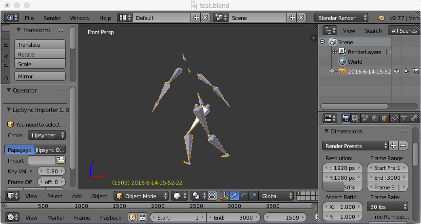

# kinect-openni-bvh-saver
This project is based on OpenNI2, NITE2, and OpenCV2, it will automatically save many skeleton animation clips to bvh files. 
 
Then you can import the bvh files into Blender or other softwares to smooth animation curves. I use Blender's default smooth key setting to smooth all rotation channels, the results is acceptable.
### Requirements
Mac OS X 10.11 
kinect for xbox 360 
OpenNI2 
NITE2 
OpenCV2 
Xcode 7.3.1
### How to use
1.Install OpenNI2, NITE2, OpenCV2. 
2.Plug kinect for xbox 360. 
3.Install Xcode 7.3.1. 
4.Open the project, build and run. 
 
When the Kinect camera detects your body, the software will automatically record the skeleton animation to a bvh file, after the Kinect camera can not detect your body, the software will finish recording the bvh file, the output path is the current directory. 
 
Enter the Kinect camera's viewport, perform actions, then leave the viewport, repeat the steps, you can record many skeleton animation clips at one time.
### Thanks
1.[Derek Hendrickx's KinectMotionCapture](https://github.com/derekhendrickx/KinectMotionCapture) 
2.[Kyle Weicht's 3D math library](https://github.com/awesomekyle/math) 
3.[Birdy's Notebook](http://bediyap.com/programming/convert-quaternion-to-euler-rotations/) 
4.[sunchy's Kinect_to_BVH_Console](https://github.com/isunchy/Kinect_to_BVH_Console) 
5.[Rishad Bharucha's openni-nite-opencv-xcode](https://github.com/rishadbharucha/openni-nite-opencv-xcode)
### License
The MIT License (MIT)
