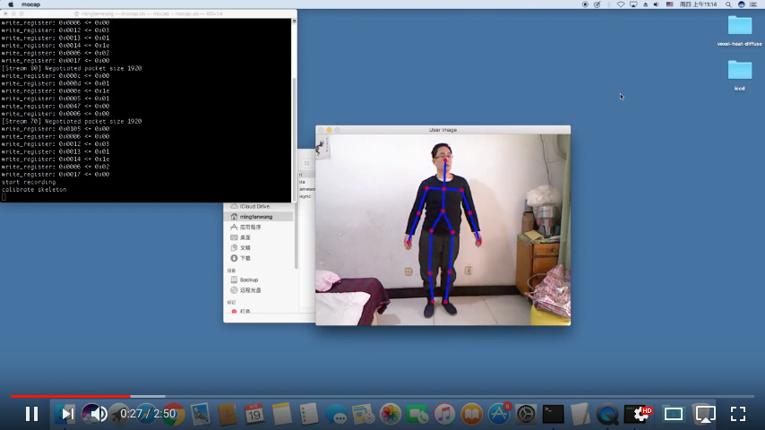

# kinect-openni-bvh-saver
This project is based on OpenNI2, NITE2, and OpenCV2, it will automatically save many skeleton animation clips to bvh files. 
 
Then you can import the bvh files into Blender or other softwares to smooth animation curves. I use Blender's default smooth key setting to smooth all rotation channels, the results is acceptable. 
 
You can turn your body around 360 degrees in this project, I am very satisfied with the result. 
 
Though the project is developed on macOS, you can port it to Linux, Windows easily, for the source code is portable. 
 
Port hint: 
1.Download OpenNI 2 SDK Binaries from [https://structure.io/openni](https://structure.io/openni), install the SDK. 
2.Git clone [https://github.com/OpenKinect/libfreenect](https://github.com/OpenKinect/libfreenect), build the kinect driver for your platform. 
3.Copy the kinect driver to OpenNI 2 SDK's "Redist/OpenNI2/Drivers". 
4.Download [NiTE2 SDK](http://pan.baidu.com/s/1gd9XdIV) or [NiTE2 SDK](https://pan.baidu.com/share/link?shareid=1109357935&uk=757472483#list/path=%2F)and install.
5.Build the source code. 
 
Click the image to watch kinect mocap demo: 

 
### Requirements
macOS 10.11 
kinect for xbox 360 
OpenNI2 
NITE2 
OpenCV2 
Xcode 7.3.1
### How to use
1.Git clone [openni-nite-opencv-xcode](https://github.com/rishadbharucha/openni-nite-opencv-xcode). 
2.Install OpenNI2, OpenCV2 from source code or via macport or homebrew, you may need to install latest libpng from source code as well. 
3.Copy all the source codes to 'openni-nite-opencv-xcode/OpenNI+NITE+OpenCV', and add them to the project. 
4.Copy /usr/local/lib/OpenNI2-FreenectDriver/libFreenectDriver.0.5.0.dylib to 'openni-nite-opencv-xcode/OpenNI2/Drivers/libFreenectDriver.dylib', then add the filename to Xcode's 'Targets->Build Phases->Copy Files(5 items)', ensure that the Subpath is 'OpenNI2/Drivers'. 
5.Plug in kinect for xbox 360. 
6.Open the project, build and run. 
 
Note: If you failed to run, just try again, for the Kinect driver for macOS is not stable. 
 
When the Kinect camera detects your body, the software will automatically record the skeleton animation to a bvh file, after the Kinect camera can not detect your body, the software will finish recording the bvh file, the output path is the current directory. 
 
Enter the Kinect camera's viewport, perform actions, then leave the viewport, repeat the steps, you can record many skeleton animation clips at one time.
### Thanks
1.[Derek Hendrickx's KinectMotionCapture](https://github.com/derekhendrickx/KinectMotionCapture) 
2.[Kyle Weicht's 3D math library](https://github.com/awesomekyle/math) 
3.[Birdy's Notebook](http://bediyap.com/programming/convert-quaternion-to-euler-rotations/) 
4.[sunchy's Kinect_to_BVH_Console](https://github.com/isunchy/Kinect_to_BVH_Console) 
5.[Rishad Bharucha's openni-nite-opencv-xcode](https://github.com/rishadbharucha/openni-nite-opencv-xcode)
### License
The MIT License (MIT)
